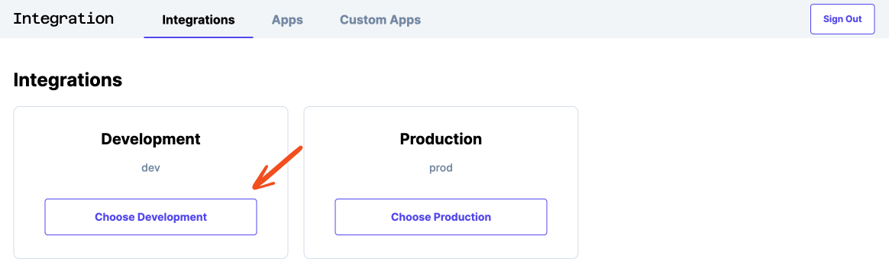
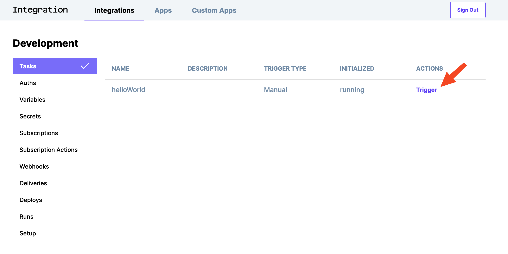

# Step 3 - Run a Task

## Visit your dashboard 

You can go to your dashboard with this link: https://integration.bigidea.io/prototype

## Select your env

There are currently two environments, `dev` and `prod`. Click on the `dev` environment.



## See the list of tasks

Selecting the tasks menu lets you view all of the deployed tasks. These correspond with the tasks in `my-integrations`.


## Run the task

To run one, click on the `Trigger` link.



## Check the output

You can view the log of the task run in your console.

```shell
[LOG]: in handleRunLocal
[LOG]: props {
  "compressedPayloadB64": "eJyrVipJLM72S8xNVbJSykjNyckPzy/KSVHSUUpJLElUsqqurQUA3SoMRw=="
}
[LOG]: payload {
  "taskName": "helloWorld",
  "data": {}
}
[LOG]: Event: {
  "action": "run",
  "taskName": "helloWorld",
  "data": {}
}
[LOG]: Context: undefined
[LOG]: in baseRequest XXX
[DEBUG]: baseRequest url https://integration.bigidea.io/api/v1/envs/dev/tasks/helloWorld/data
[DEBUG]: baseRequest options {
  "method": "GET",
  "headers": {
    "Authorization": "apiKey *****abe",
    "Content-Type": "application/json"
  }
}
[DEBUG]: about to return from baseRequest
[LOG]: About to run task helloWorld
[LOG]: taskIndex helloWorld
[LOG]: about to make the fn call
# highlight-next-line
[LOG]: Hello World! Nice to meet you!
[LOG]: Uploaded run result
```

During development, your tasks are run locally to give you a really tight feedback loop.
