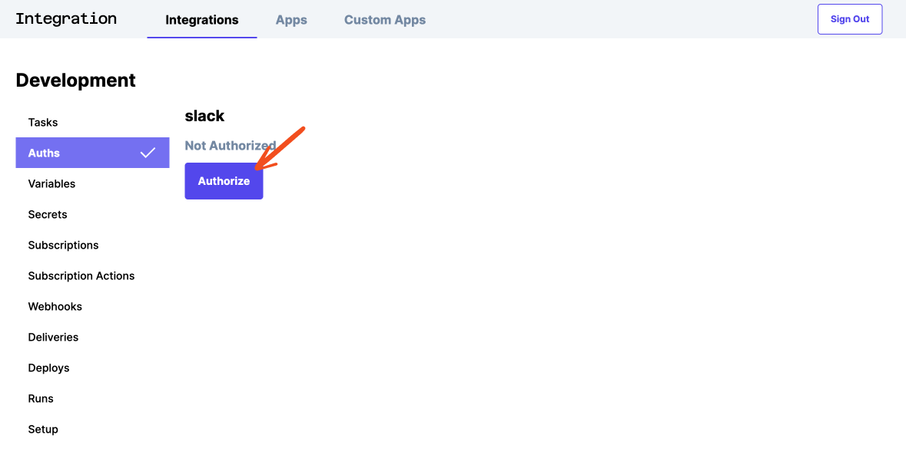
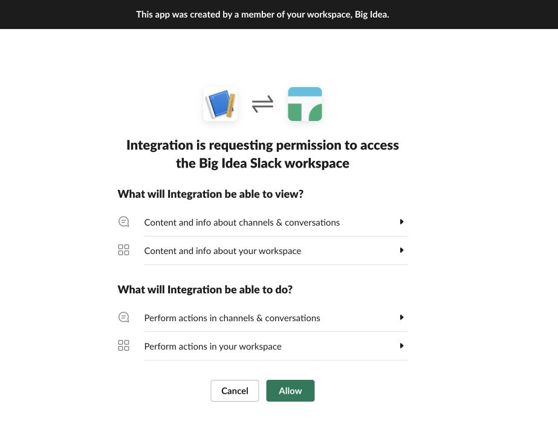
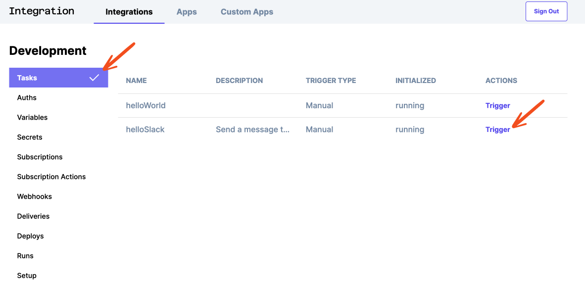

# Step 4 - Authorize an App

## Enable the `helloToSlack` task

In `src/index.js`, uncomment the import of `./tasks/helloToSlack`  

```typescript
import "./tasks/helloWorld";
// highlight-next-line
import "./tasks/helloToSlack";
// import "./tasks/webhookToSlack";
```

## Take a look at the `helloToSlack` task

There are a few more things happening here compared to our `helloWorld` example. 

```typescript
import { defineTask } from "@bigidea/integration";
import { Slack } from "@bigidea/slack";

defineTask({
  name: "helloSlack",
  description: "Send a message to Slack",
  auths: {
    slack: Slack.defineAuth({
      name: "slack",
    }),
  },
  run: async ({ auths }) => {
    const slack = new Slack({ auth: auths.slack });

    await slack.postMessage({
      channel: "#general", // <-- you might want to change this!
      text: "Hello Slack!",
    });
  },
});
```

First, we've imported the `Slack` connector

```typescript
import { defineTask } from "@bigidea/integration";
// highlight-next-line
import { Slack } from "@bigidea/slack";
...
```

Next, we've created an `Auth` on the task using `Slack.defineAuth`

```typescript
...
defineTask({
  name: "helloSlack",
  description: "Send a message to Slack",
  // highlight-start
  auths: {
    slack: Slack.defineAuth({
      name: "slack",
    }),
  },
  // highlight-end
  ...
});
```

Then we're using that `Auth` to instantiate a `Slack` connector 

```typescript
defineTask({
  ...
  run: async ({ auths }) => {
    // highlight-next-line
    const slack = new Slack({ auth: auths.slack });

    await slack.postMessage({
      channel: "#general", // <-- you might want to change this!
      text: "Hello Slack!",
    });
  },
});
```

And finally we're using that connector instance to post a message to the `#general` channel in Slack. You should select an appropriate channel so you don't irritate or confuse your co-workers! 🙂

```typescript
defineTask({
  ...
  run: async ({ auths }) => {
    const slack = new Slack({ auth: auths.slack });

    // highlight-start
    await slack.postMessage({
      channel: "#general", // <-- you might want to change this!
      text: "Hello Slack!",
    });
    // highlight-end
  },
});
```

## Authorize an auth

Let's go back to the dashboard: https://integration.bigidea.io/prototype and click on Auths and on the newly created `slack` auth.


You will see a screen like this. Click on the `Authorize` button.



This will take you through a standard Oauth flow. Click the `Allow` button.



And you have now successfully authorized access to your Slack account.


## Run the `helloToSlack` task



## See the result in Slack

Take a look at the channel you posted the message to and you should see the result:

