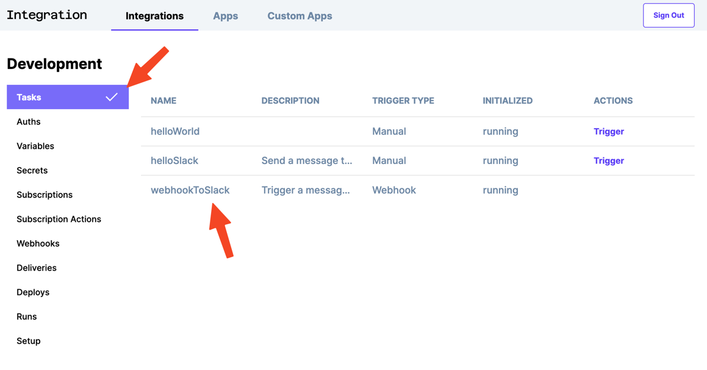
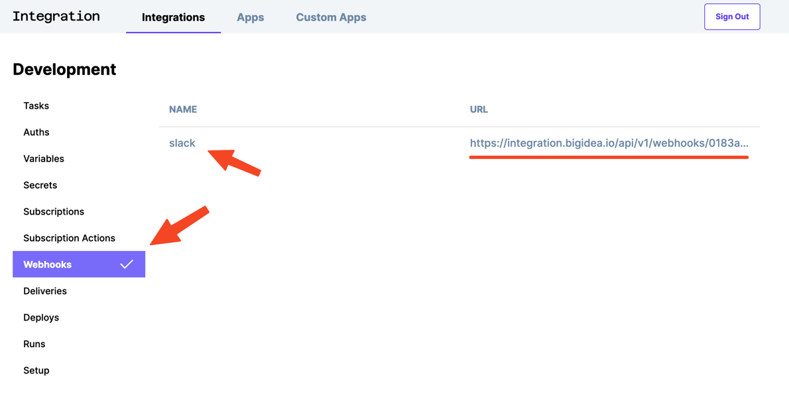
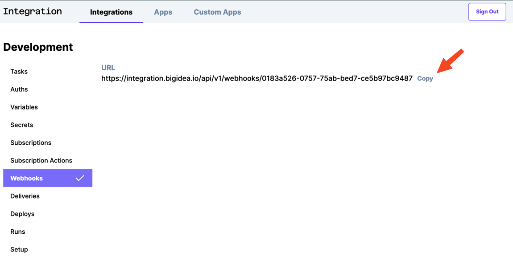

# Step 5 - Trigger a Webhook

## Enable the `webhookToSlack` task

In `src/index.js`, uncomment the import of `./tasks/webhookToSlack`.

```typescript
import "./tasks/helloWorld";
import "./tasks/helloToSlack";
// highlight-next-line
import "./tasks/webhookToSlack";
```

## Take a look at the `webhookToSlack` task

There are two key differences from the `helloSlack` task. See if you can spot them.

```typescript
import { defineTask, defineWebhook } from "@bigidea/integration";
import { Slack } from "@bigidea/slack";

defineTask({
  name: "webhookToSlack",
  description: "Trigger a message in Slack from a Webhook",
  trigger: {
    webhook: defineWebhook({ name: "slack" }),
  },
  auths: {
    slack: Slack.defineAuth({
      name: "slack",
    }),
  },
  run: async ({ auths }) => {
    const slack = new Slack({ auth: auths.slack });

    await slack.postMessage({
      channel: "#general", // <-- Might want to change!
      text: "Triggered by a webhook",
    });
  },
});
```

We're importing `defineWebhook` from `@bigidea/integration`.

```typescript
// highlight-next-line
import { defineTask, defineWebhook } from "@bigidea/integration";
import { Slack } from "@bigidea/slack";
...
```

And we're using it to define a webhook that will trigger the task.

```typescript
...
defineTask({
  name: "webhookToSlack",
  description: "Trigger a message in Slack from a Webhook",
  // highlight-start
  trigger: {
    webhook: defineWebhook({ name: "slack" }),
  },
  // highlight-end
  auths: {
    slack: Slack.defineAuth({
      name: "slack",
    }),
  },
...
```

One thing that is not different is the auth section. By (re)defining a an auth with the same name, we are simply reusing the same auth as the `helloSlack` task.

```typescript
...
defineTask({
  name: "webhookToSlack",
  description: "Trigger a message in Slack from a Webhook",
  trigger: {
    webhook: defineWebhook({ name: "slack" }),
  },
  // highlight-start
  auths: {
    slack: Slack.defineAuth({
      name: "slack",
    }),
  },
  // highlight-end
  run: async ({ auths }) => {
    const slack = new Slack({ auth: auths.slack });
...
```

Once again, consider which channel you want to post the message in.

```typescript
  run: async ({ auths }) => {
    const slack = new Slack({ auth: auths.slack });

    await slack.postMessage({
      // highlight-next-line
      channel: "#general", // <-- Might want to change!
      text: "Triggered by a webhook",
    });
  },
```

## Check out the new task

In the tasks section, you should see `webhookToSlack`.



## And the new webhook

You can see the webhook named `slack` as well as an auto-generated url. 



If you look closely at that URL, you'll see it's publicly accessible. This means that it can be triggered by other applications on the internet that do not have access to your local network. 

## Trigger the task

Copy the webhook url to your clipboard



and paste the url in a browser tab to trigger the task.


## See the result in Slack

Take a look in the channel you posted to and you should see a message like this.


## Look at the logs in your dev server

You can see that even though you triggered the task with a publicly-accessible URL, the task was executed locally in your dev server.

```json
...
 "data": {
    "ok": true,
    "channel": "C03KKLDG7R9",
    "ts": "1664985821.281049",
    "message": {
      "bot_id": "B03K56UES8P",
      "type": "message",
      // highlight-next-line
      "text": "Triggered by a webhook",
      "user": "U03KKNKQ3KM",
      "ts": "1664985821.281049",
      "app_id": "A03KKQ8FKC2",
      "team": "T03KD4K7R62",
...
```